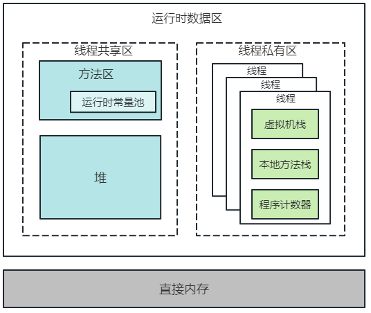

## JVM内存结构



## 类的加载过程

1. **加载**：通过类名获取类的二进制字节流是通过类加载器来完成的。其加载过程使用“双亲委派模型”
2. **验证**：当一个类被加载之后，必须要验证一下这个类是否合法，比如这个类是不是符合字节码的格式、变量与方法是不是有重复、数据类型是不是有效、继承与实现是否合乎标准等等。总之，这个阶段的目的就是保证加载的类是能够被jvm所运行。
3. **准备**：为类变量（静态变量）在方法区分配内存，并设置零值。注意：这里是类变量，不是实例变量，实例变量是对象分配到堆内存时根据运行时动态生成的。
4. **解析**：把常量池中的符号引用解析为直接引用：根据符号引用所作的描述，在内存中找到符合描述的目标并把目标指针指针返回。
5. **初始化**：类的初始化过程是这样的：按照顺序自上而下运行类中的变量赋值语句和静态语句，如果有父类，则首先按照顺序运行父类中的变量赋值语句和静态语句在类的初始化阶段，只会初始化与类相关的静态赋值语句和静态语句，也就是有static关键字修饰的信息，而没有static修饰的赋值语句和执行语句在实例化对象的时候才会运行。执行()方法（clinit是class initialize的简写）


## 对象创建流程

1. 检查加载（类信息）
2. 分配内存 
   - 划分内存的方式有 指针碰撞、空闲列表
   - 解决并发安全：CAS锁、TLAB（Thread Local Allocate Buffer（线程本地缓冲），每个线程分配自己的Buffer）
3. 内存空间初始化（0值化）
4. 设置（对象头）
5. 对象初始化（构造方法）

### 对象头

 1. ##### 储存对象自身的运行时数据（mark word）

     1. 哈希吗
     2. GC分代年龄
     3. 锁状态标识
     4. 线程持有的锁
     5. 偏向线程ID
     6. 偏向时间戳

2. ##### 类型指针

   - 指向方法区的类变量

3. ##### 若为数组对象，还应以后记录数组长度的数据

## 对象的访问定位

句柄池 --> Java堆实例

主流是使用直接指针---》地址修改时需要更新线程数据

## JVM参数： 

```
-Xint：设置 jvm 以解释模式运行，所有的字节码将被直接执行，而不会编译成本地码
-Xmixed：混合模式，JVM自己来决定是否编译成本地代码，默认使用的就是混合模式
-Xbatch：关闭后台代码编译，强制在前台编译，编译完成之后才能进行代码执行。 默认情况下，jvm 在后台进行编译，若没有编译完成，则前台运行代码时以解释模式运行
-Xbootclasspath:bootclasspath：让 jvm 从指定路径（可以是分号分隔的目录、jar、或者zip）中加载bootclass，用来替换 jdk 的 rt.jar；若非必要，一般不会用到
-Xbootclasspath/a:path ：将指定路径的所有文件追加到默认 bootstrap 路径中
-Xfuture：让jvm对类文件执行严格的格式检查（默认 jvm 不进行严格格式检查），以符合类文件格式规范，推荐开发人员使用该参数。
-Xincgc：开启增量 gc（默认为关闭），这有助于减少长时间GC时应用程序出现的停顿，但由于可能和应用程序并发执行，所以会降低CPU对应用的处理能力
-Xloggc:file： 与-verbose:gc功能类似，只是将每次GC事件的相关情况记录到一个文件中，文件的位置最好在本地，以避免网络的潜在问题。若与 verbose 命令同时出现在命令行中，则以 -Xloggc 为准
-Xms：指定 jvm 堆的初始大小，默认为物理内存的1/64，最小为1M，可以指定单位，比如k、m，若不指定，则默认为字节
-Xmx：指定 jvm 堆的最大值，默认为物理内存的 1/4或者1G，最小为2M；单位与-Xms一致
-Xprof：跟踪正运行的程序，并将跟踪数据在标准输出输出；适合于开发环境调试
-Xss： 设置单个线程栈的大小，一般默认为 512k

-XX:+PrintGCDetails 开启GC日志

-XX:NewSize：设置年轻代最小空间大小
-XX:MaxNewSize：设置年轻代最大空间大小
-XX:PermSize：设置永久代最小空间大小
-XX:MaxPermSize：设置永久代最大空间大小
-XX:NewRatio：设置年轻代和老年代的比值。默认值-XX:NewRatio=2，表示年轻代与老年代比值为1:2，年轻代占整个堆大小的1/3
-XX:SurvivorRatio：设置年轻代中Eden区Survivor区的容量比值。默认值-XX:SurvivorRatio=8，表示Eden : Survivor0 : Survivor1 = 8 : 1 : 1
-XX:-OmitStackTraceInFastThrow：关闭（省略异常栈从而快速抛出），默认开启。如果想将所有异常信息都抛出，建议关闭。
-XX:+HeapDumpOnOutOfMemoryError：表示当JVM发生OOM时，自动生成DUMP文件。
-XX:HeapDumpPath=/usr/local/dump：dump文件路径或者名称。如果不指定文件名，默认为：java_<pid>_<date>_<time>_heapDump.hprof


```


## 垃圾回收

### 可达性分析

#### GCRoots 

1. 静态对象
2. 常量池
3. 局部变量
4. JNI指针
5. 内部引用 class对象、异常对象Exception、类加载器
6. 锁 synchronized对象
7. 内部对象
8. 临时对象：跨代引用

#### class回收比较苛刻  

1. class 实例化的所有对象都要回收

2. 对应的类加载器 也要被回收掉

3. 类 java.lang.class对象，

4. 任何地方没有被引用，并且无法通过反射调这个类

5. 参数控制 -Xboclassgc

   

#### Finalize

​	在对象被回收的时候会调用，可以挽回对象

​	但只会被调用一次


## 对象分配策略

几乎所有的对象分配在堆中，但也有在栈上分配

大对象会被直接分配在老年代（只有在Serial或ParNew这两个垃圾回收器才生效）

虚拟机的优化技术：

1. **逃逸分析 + 触发JIT（热点数据）**

   **逃逸分析的原理**：分析对象动态作用域，当一个对象在方法中定义后，它可能被外部方法所引用。 比如：调用参数传递到其他方法中，这种称之为方法逃逸。甚至还有可能被外部线程访问到，例如：赋值给其他线程中访问的变量，这个称之为线程逃逸。 从不逃逸到方法逃逸到线程逃逸，称之为对象由低到高的不同逃逸程度。

2. **本地线程分配缓冲**


## 对象分配原则    

1. 对象优先在Eden分配
2. 空间分配担保（新生代复制到老年代时）
3. 大对象直接进入老年代（部分JVM才有）
4. 长期存活对象进入老年代
5. 动态对象年龄判定（如果在Survivor空间中相同年龄所有对象大小的总和大于Survivor空间的一半，年龄大于或等于该年龄的对象就可以直接进入老年代，无须等到MaxTenuringThreshold中要求的年龄。）

## 虚拟机优化技术

1. 逃逸分析
2. 本地线程分配缓冲 TLAB

## 垃圾回收算法

1. 复制回收算法升级版（Appel）（新生代）8 ：1：1

   实现简单、运行高效、没有内存碎片，空间利用率低    升级版：提高空间利用率和空间分配担保   

2. 标记清除算法

   优点：可以做到线程不暂停     缺点：位置不连续、会产生碎片空间      

3. 标记整理算法 --- 先整理  在回收

   优点：没有内存碎片   缺点：指针需要移动


## CMS垃圾回收器 

特性：并发 、只针对老年代

以减少STW为目的的垃圾回收器  Concurrent Mark Sweep    使用了标记清除算法


```
老年代的机制与一个叫CARD TABLE的东西（这个东西其实就是个数组,数组中每个位置存的是一个byte）密不可分。

CMS将老年代的空间分成大小为512bytes的块，card table中的每个元素对应着一个块。

并发标记时，如果某个对象的引用发生了变化，就标记该对象所在的块为  dirty card。

并发预清理阶段就会重新扫描该块，将该对象引用的对象标识为可达。
```

### 预清理：只一次

- 并发标记过程中，eden区对象引用了old对象（**发生跨代引用**），则认为eden区对象为可达
- 老年代内部引用变化，将该分区标记为dirty，为重新标记提供方向。记录类似于卡表结构

### 并发可中断预清理：循环

​	执行条件：当eden区使用内存超过2M

- 同上，但eden区变成了*survive*区
- 它会尝试若干次预清理过程，直到次数到达GC允许的上限，或者超过指定时间
-   -可中断的条件：1）可以设置循环次数。2）可以设置时间。3）EDEN区的最大比例（大于比例退出循环）。

### CMS垃圾清理日志


### CMS存在的问题

- CPU敏感  要求CPU >= 4
- 浮动垃圾   并发清理过程中产生的垃圾，要预留空间，导致无法等到内存占用满再开始GC
- 内存碎片   搭配其他垃圾回收器使用

## JVM调优


## 常量池

#### Class常量池

主要存放两大类常量：字面量（Literal）和符号引用（Symbolic References）。字面量比较接近于Java语言层面的常量概念，如文本字符串、被声明为final的常量值等。而符号引用则属于编译原理方面的概念，主要包括下面几类常量：

- 被模块导出或者开放的包（Package）

- 类和接口的全限定名（Fully Qualified Name）

- 字段的名称和描述符（Descriptor）

- 方法的名称和描述符

- 方法句柄和方法类型（Method Handle、Method Type、Invoke Dynamic）

- 动态调用点和动态常量（Dynamically-Computed Call Site、Dynamically-Computed Constant）

#### 运行时常量池

将运行时的字面量转换成真实地址

运行时常量池相对于class温江常量池的一个重要特征是具有**动态性**。这是什么意思呢，就是当你的class文件一旦编译后，你的class常量池就是确定了的，而运行时常量池在运行期间也可能有新的常量放入池中（如String类的intern()方法）

#### 字符串常量池

