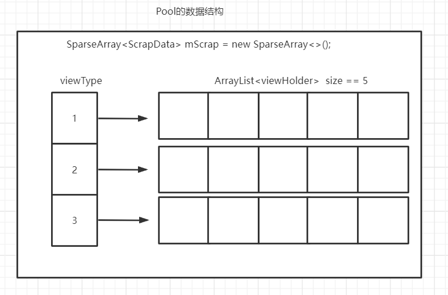
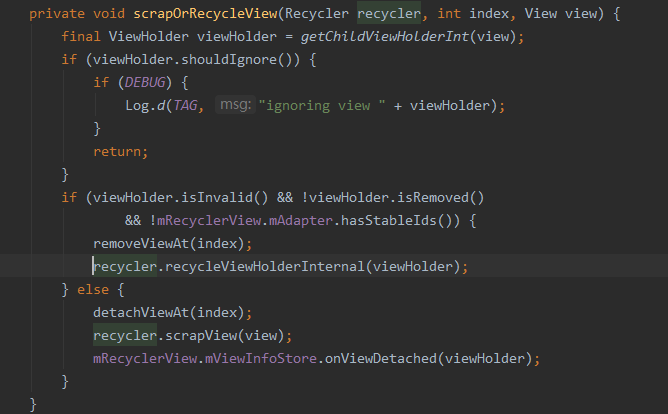

## 获取缓存流程

```java
RecyclerView
--> onTouchEvent()
    --> scrollByInternal()
       --> scrollStep(x, y, mReusableIntPair)
          --> mLayout.scrollVerticallyBy(dy, mRecycler, mState)
             --> scrollBy(dy, recycler, state)
                --> fill() //核心方法
                  --> layoutChunk() --> layoutState.next() --> recycler.getViewForPosition(mCurrentPosition)
--> tryGetViewHolderForPositionByDeadline()  			  //核心方法   获取或创建ViewHolder
    ==> getChangedScrapViewForPosition(position) 		  //如果是preLayout  在mChangedScrap中获取缓存 通过layoutPosition和itemId
    ==> getScrapOrHiddenOrCachedHolderForPosition() 	  //通过layoutPosition 在 mAttachedScrap 和 mCachedViews 中获取缓存
    ==> getScrapOrCachedViewForId() 					  //通过ItemId 从 mAttachedScrap 和 mCachedViews中获取缓存
    ==> mViewCacheExtension.getViewForPositionAndType()  //从自定义缓存中获取
    ==> getRecycledViewPool().getRecycledView() 		  //从 mRecyclerPool 中获取缓存
    //以上未获取到缓存
    mAdapter.createViewHolder() --> onCreateViewHolder() //执行create方法创建新的ViewHolder
    tryBindViewHolderByDeadline() --> onBindViewHolder() //执行bindViewHolder
```


## 加入缓存流程

```java
区别于获取缓存   加入缓存分为两块  
mCachedView 和 mRecyclerPool 在上下滑动时缓存  
从上 fill()方法开始
    --> recycleByLayoutState(recycler, layoutState); //在这里回收 判断当前是上滑还是下滑
    	--> recycleViewsFromEnd()/recycleViewsFromStart()
     		--> recycleChildren() --> removeAndRecycleViewAt() --> recycler.recycleView(view) --> 
       		--> recycleViewHolderInternal(holder);
         			==> recycleCachedViewAt(0) //缓存到 mCacheView 中，size=2 如果超出size，移除0位置
            		==> addViewHolderToRecycledViewPool() //将上面0位置的viewhodler，重置所有状态 添加到 pool 中， 如果pool满了，直接抛弃
              			--> scrap.getItemViewType() //获取需要缓存的ViewHolder的viewType
                 			--> scrapHeap = getScrapDataForType(viewType).mScrapHeap//根据viewType找到对应的缓存pool
         						--> scrap.resetInternal(); -- scrapHeap.add(scrap);

mChangeScrap与 mAttachedScrap 在 layout时缓存
这两个缓存列表主要负责：
mAttachedScrap: 缓存当前屏幕上显示的 ViewHolder
mChangeScrap: 被 notifyxxx 改变的 ViewHolder
dispatchLayoutStep2()
    --> mLayout.onLayoutChildren(mRecycler, mState);
    	--> detachAndScrapAttachedViews()
     		--> scrapOrRecycleView()
    			--> recycler.scrapView(view);  //缓存流程
dispatchLayoutStep3()
    --> mLayout.removeAndRecycleScrapInt(mRecycler);
    	--> recycler.clearScrap(); //清空流程

```



Scrap： scrap是用来保存被rv移除掉但最近又马上要使用的缓存，比如rv自带item的动画效果，本质上就是计算item的偏移量然后执行属性动画的过程，这中间可能就涉及到需要将动画之前的item保存下位置信息，动画后的item再保存下位置信息，然后利用这些位置数据生成相应的属性动画，如何保存这些viewholer呢，就需要使用到scrap了，因为这些viewholer数据上是没有改变的，只是位置改变而已，所以放置到scrap最为合适。稍微仔细看的话就能发现scrap缓存有两个成员mChangedScrap和mAttachedScrap，它们保存的对象有些不一样，一般调用adapter的notifyItemRangeChanged被移除的viewholder会保存到mChangedScrap，其余的notify系列方法(不包括notifyDataSetChanged)移除的viewholder会被保存到mAttachedScrap中

cached： 也是一个非常重要的缓存，就LinearLayoutManager来说，cached缓存默认大小为2，他的容量非常小，所起到的作用就是rv滑动时候刚被移出屏幕的viewholder的收容所，因为rv会认为刚被移出屏幕 的viewholder可能马上就会使用到，所以不会立即设置为无效viewholder，会将他们保存到cached中，但又不能将所有移除屏幕的viewholder视为有效viewholder，所以他的默认容量只有两个，可以通过setViewCacheSize(int viewCount)方法修改

extension: 第三级缓存，这是一个自定义缓存，rv可以自定义缓存行为，在这里你可以决定缓存的保存逻辑，但是这么个自定义缓存一般都没有见过具体的使用场景，而且自定义缓存需要你对rv中的源码非常熟悉才行，否则在rv执行item动画，或者执行notify的一系列方法后你的自定义缓存是否还能有效就是一个值得考虑的问题，所以一般不太推荐使用该缓存，更多的我觉得这可能是google自已留着方便扩展来使用的，目前来说这还只是个空实现而已，从这点来看其实rv所说的四级缓存本质上还只是三级缓存。

pool： 又一个重要的缓存，这也是唯一一个我们开发者可以方便设置的一个(虽然extension也能设置，但是难度大)，而且设置方式非常简单，new一个pool传进去就可以了，其他的都不用我们来处理，google已经给我们料理好后事了，这个缓存保存的对象就是那些无效的viewholder，虽然说无效的viewholder上的数据是无效的，但是他的rootview还是可以拿来使用的，这也是为什么最早listview有一个convertView的原因，当然这种机制也被rv很好的继承下来了，pool一般会和cached配合使用，这么来说cached存不下的就会被保存到pool中，毕竟cached的默认容量大小只有2，但是pool容量也是有限的当保存满之后再有viewholder到来的话就只能会无情抛弃掉，它也有一个默认的容量大小 private static final int DEFAULT_MAX_SCRAP = 5; int mMaxScrap = DEFAULT_MAX_SCRAP; 这个大小也是可以通过调用方法来改变，具体看应用场景，一般来说正常使用的话使用默认大小即可。作者：SlideException链接：https://www.jianshu.com/p/dfe299126a74来源：简书著作权归作者所有。商业转载请联系作者获得授权，非商业转载请注明出处。

**四级缓存   也可以说是三级，第一级不算**

1. mChangeScrap与 mAttachedScrap 用来缓存还在屏幕内的 ViewHolder

   mAttachedScrap：未与RecyclerView分离的ViewHolder列表，也就是当前屏幕上可见的

   mChangedScrap：存储 notifXXX 方法时需要改变的 ViewHolder

2. mCachedViews 用来缓存移除屏幕之外的 ViewHolder 3. mViewCacheExtension （暂不考虑） 开发给用户的自定义扩展缓存，需要用户自己 管理 View 的创建和缓存 4. RecycledViewPool ViewHolder 缓存池（类似HashMap）

   该缓存池中，数据是根据viewType分类的，不同的ViewType对应着不同的ScrapType，ScrapType中存储着一个大小为5的List

## ViewHolder创建流程

tryBindViewHolderByDeadline

在创建ViewHolder之前，会一层一层调用获取缓存，如果全都取不到，就会执行createViewHolder，创建完成之后进行bindViewHolder

## 回收流程

LayoutManager.onLayoutChildren--> ---> ---> 到RecyclerView中scrapOrRecycleView

两种情况

第一种情况

若ViewHolder没有变化，判断mCacheView的大小是否大于2， 若大于，将mCacheView（0）添加到recyclerPool中，再将要缓存的holder放入cacheView

若变化了，直接放入RecyclerPool




## 数据预取

目的 ：

​	在Recycler被拖拽并刷新过程中，为了优化UI。

​	当RecyclerView被Drag或Fling时，满足位移条件时触发

### GapWork

​	

1. 当UI线程处理结束后，绘制流程由RenderThread完成，这个时候UI线程会处于空闲状态，利用该时间来完成Item的预拉取
2. 在RecyclerView绑定视图AttachWindow的时候创建GapWork，并存入ThreadLocal
3. 当RecyclerView滑动超过阈值时，触发任务，计算当前帧还剩下多少时间，传入deadLine
4. buildTaskList  计算需要预取条目的位置 layout.collectInitialPrefetchPositions --> addPosition, 新建需要预取的task，并根据显示顺序排序
5. flushTaskWithDeadline ---> prefetchPositionWithDeadline，从缓存中尝试获取对应ViewHolder对象，如果查不到，就创建并绑定
6. 根据是否绑定成功，存入mCacheViews或者RecyclerViewPool
7. 在此期间，**mCacheViews会被扩容，预取对象会放到离屏缓存后面**

