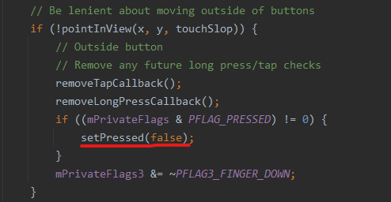

## Touch事件从哪里来

```java
setView@ViewRootImpl 
 -->WindowInputEventReceiver  //监听系统的Touch事件  传递给InputStage  
    -->enqueueInputEvent
    	-->doProcessInputEvents
    		-->deliverInputEvent
    			-->stage.deliver(q);
InputStage viewPostImeStage = new ViewPostImeInputStage(mSyntheticInputStage);
-->onProcess(QueuedInputEvent q)
    -->processPointerEvent(q);
		-->mView.dispatchPointerEvent(event);
			-->DecorView.dispatchTouchEvent
                --> Activity.dispatchTouchEvent //先到PhoneWindow  在分发给DecorView
                	-->DecorView.superDispatchTouchEvent //这里才是Decor的真正处理
                
                
// 处理流程  Activity
processPointerEvent()@ViewRootImpl
	--> view.dispatchTouchEvent() // DecorView.java
        -->windowCallBack.dispatchTouchEvent(ev)  //windowCallBack == Activity
           --> getWindow().superDispatchTouchEvent(ev) //  PhoneWindow -->
              --> mDecor.superDispatchTouchEvent(event); // DecorView
              	 --> super.dispatchTouchEvent(event)@DecorView.java //开始执行ViewGroup的dispatch
              		--> 开始ViewTree的事件分发
           --> onTouchEvent(ev)@Activity // 如果viewTree不处理事件，回到activiy的onTouchEvent
```

### onTouch、onTouchEvent、onClick

onTouch返回值为true时代表已经消费事件，onTouchEvent不会执行，onClick也就不会执行


### 为什么手指从Button移出后将不再执行OnClick

当检测到手指移出button外时!pointInView，会调用setPressed将按压状态设备false，将不能进入perfromClick的判断

触发ACTION_CANCEL同样如此



### LongClick怎么触发--默认400

在Action_Down的时候，会发送一个handler用于触发performLongClick，触发后将不会执行performClick

也会在ACTION_CANCEL和!pointInView时取消


