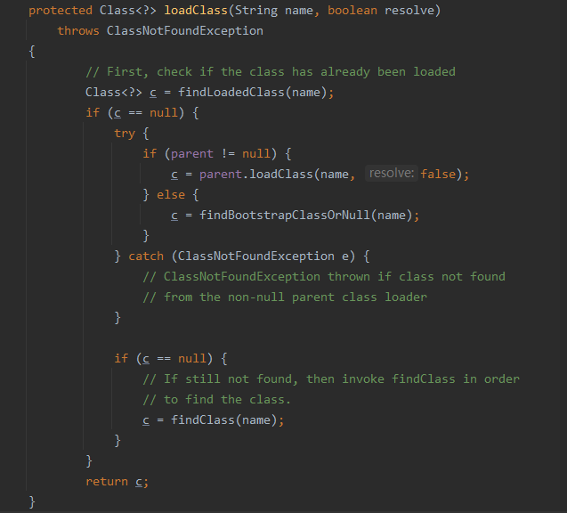
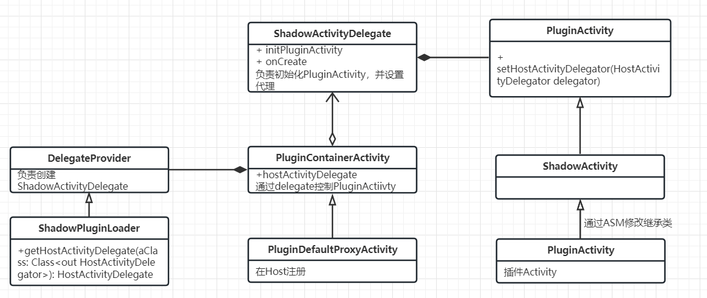

### 插件化是什么?

插件化技术最初源于免安装运行 `Apk`的想法，使代码不需要安装就可以在设备上运行。


### 为什么有插件化？

1. 应对每个dex包65536个方法数的上限问题

2. 实现功能复杂的app的拆解，能够按需下载和加载运行所需的模块


#### 案例：

Facebook是进行插件化开发尝试的鼻祖，早期Facebook安装包变大以后出现的两个导致安装失败的问题:

1. Number of Java methods in our app more than 65536(64K), can‘t hold in one dex file.
2. Large number of methods was exceeding “LinearAlloc” buffer and causing dexopt to crash

第一个错误是说方法数目超过最大数目64K，这是因为Android每个Dex文件的方法通过两个字节进行索引，两个字节能索引的最大数目就是64K。第二个错误是说单个dex包大小超出了Dexopt所能使用的最大缓存。Dexopt是将.dex文件进行优化，并转化成.odex的工具，所能使用的最大缓存跟手机相关，一般为8M或16M，如果dex包太大就有可能超出Dexopt所能使用的最大缓存，导致出错。

​	对此Facebook采取了两种方法来解决以上问题，总结如下：

1. 将安装包拆分成多个dex文件，运行时通过DexClassLoader动态载入

2. 找到Delvik虚拟机的缓存设置代码片段，替换成更大的缓存


#### Google

后来，Google在Android里引入这种问题一的解决方法，MultiDex方法，并将其标准化（5.0以下版本，buildtools升级到21即可使用支持包)。


## 插件化技术的历史

| **插件化框架名称**   | **作者**                                                     | **Github地址**                                     | **支持类别**     | **需要在清单文件注册** |
| -------------------- | ------------------------------------------------------------ | -------------------------------------------------- | ---------------- | ---------------------- |
| AndroidDynamicLoader | 2012年大众点评的屠毅敏（最早的动态加载实现方案）【代理`Fragment`】 | https://github.com/mmin18/AndroidDynamicLoader     | 只支持`Activity` | 否                     |
| Altas                | 2013年淘宝的伯奎 【`hook`底层】                              | https://alibaba.github.io/atlas/                   | 支持四大组件     | 否                     |
| dynamic-load-apk     | 2014年百度的任玉刚 【代理`Activity`】                        | https://github.com/singwhatiwanna/dynamic-load-apk | 只支持`Activity` | 否                     |
| DroidPlugin          | 2015年奇虎360的张勇【`hook`】                                | https://github.com/Qihoo360/DroidPlugin            | 支持四大组件     | 否                     |
| DynamicAPK           | 2015年携程【基于`OpenAltas`】                                | https://github.com/CtripMobile/DynamicAPK          | 只支持`Activity` | 否                     |
| Small                | 2015年二手车交易平台林光亮【`hook`】                         | https://github.com/wequick/Small                   | 支持四大组件     | 是                     |
| RePlugin             | 2017年奇虎360手机卫士【`hook`】                              | https://github.com/Qihoo360/RePlugin               | 支持四大组件     | 否                     |
| VirtualApk           | 2017年滴滴                                                   | https://github.com/didi/VirtualAPK                 | 支持四大组件     | 否                     |
| Shadow               | 2019腾讯                                                     | https://github.com/Tencent/Shadow                  | 支持四大组件     | 否                     |


#### 插件化优势

- 减少安装`Apk`的体积、按需下载模块
- 动态更新插件
- 宿主和插件分开编译，提升开发效率
- 解决方法数超过65535的问题


## Android类加载器


### 双亲委派模型




生成Dex的命令--进入build-tools目录

dx --dex --output=output.dex input.class

## 如何加载插件中的类

- 通过给插件apk生成相应的DexClassLoader便可以访问其中的类，这里又有两种实现方案单DexClassLoader与多DexClassLoader

### 单DexClassLoader

- 插件的DexClassLoader中的pathList合并到主工程的DexClassLoader中
- 优点是不同的插件以及主工程间可以直接互相调用类和方法，并且可以将不同插件的公共模块抽出来放在一个common插件中直接供其他插件使用(Small采用此方案)
- 缺点：若两个不同的插件工程引用了一个库的不同版本，则程序可能会出错，所以要通过一些规范去避免该情况发生。
- 实现代码如下

```kotlin
binding.btnSingleDexClassLoader.setOnClickListener {
    loadDex(this, listOf(plugin001Path,plugin002Path))

    val clazzApp = Class.forName("com.young.plugindemo.TestApp")
    val methodApp = clazzApp.getMethod("test")
    methodApp.invoke(clazzApp.newInstance())

    val clazzPlugin001 = Class.forName("com.young.plugin001.TestPlugin001")
    val methodPlugin001 = clazzPlugin001.getMethod("test")
    methodPlugin001.invoke(clazzPlugin001.newInstance())

    val clazzPlugin002 = Class.forName("com.young.plugin002.TestPlugin002")
    val methodPlugin002 = clazzPlugin002.getMethod("test")
    methodPlugin002.invoke(clazzPlugin002.newInstance())
}

fun loadDex(context: Context, pluginPaths: List<String>) {
    try {
        // 获取 pathList
        val systemClassLoader = Class.forName("dalvik.system.BaseDexClassLoader")
        val pathListField = systemClassLoader.getDeclaredField("pathList")
        pathListField.isAccessible = true
        // 获取 dexElements
        val dexPathListClass = Class.forName("dalvik.system.DexPathList")
        val dexElementsField = dexPathListClass.getDeclaredField("dexElements")
        dexElementsField.isAccessible = true
        // 获取宿主的Elements
        val hostClassLoader = context.classLoader
        val hostPathList = pathListField.get(hostClassLoader)
        val hostElements = dexElementsField.get(hostPathList) as kotlin.Array<*>
        var newElements: kotlin.Array<*> = hostElements
        // 遍历获取插件的Elements
        for (path in pluginPaths) {
            val pluginClassLoader = PathClassLoader(path, context.classLoader)
            val pluginPathList = pathListField.get(pluginClassLoader)
            val pluginElements = dexElementsField.get(pluginPathList) as kotlin.Array<*>
            // 创建数组
            val temp = Array.newInstance(
                pluginElements.javaClass.componentType!!,
                newElements.size + pluginElements.size
            ) as kotlin.Array<*>

            // 给新数组赋值,先用宿主的，再用插件的
            System.arraycopy(newElements, 0, temp, 0, newElements.size)
            System.arraycopy(
                pluginElements,
                0,
                temp,
                newElements.size,
                pluginElements.size
            )
            // 合并
            dexElementsField.set(hostPathList, temp)
            newElements = temp
        }
    } catch (e: Exception) {
        e.printStackTrace()
    }
}
```

### 多DexClassLoader

- 为每个插件都生成一个DexClassLoader，当加载该插件中的类时需要通过对应DexClassLoader加载
- 这种方案的优点是不同插件的类是隔离的，当不同插件引用了同一个类库的不同版本时，不会出问题(RePlugin采用此方案)
- 代码如下

```kotlin
val nativeLibDir = File(filesDir, "pluginlib").absolutePath
val dexOutPath = File(filesDir, "dexout").absolutePath

val plugin001Path = File(filesDir.absolutePath, "plugin001.apk").absolutePath
val pluginClassLoader = DexClassLoader(plugin001Path, dexOutPath, nativeLibDir, this::class.java.classLoader)

val plugin002Path: String = File(filesDir.absolutePath, "plugin002.apk").absolutePath
val pluginClassLoader2 = DexClassLoader(plugin002Path, dexOutPath, nativeLibDir, this::cla
```

# 资源加载

- Android系统通过Resource对象加载资源,因此，只要将插件apk的路径加入到AssetManager中，便能够实现对插件资源的访问

## 资源路径的处理

### 1. 合并式：

- addAssetPath时加入所有插件和主工程的路径；
- 优点：插件和宿主能直接相互访问资源
- 缺点：会引入资源冲突(由于主工程和各个插件都是独立编译的，生成的资源id会存在相同的情况)
- 实现代码如下，其中我将插件的包名与宿主设置成相同的，具体原因见下面shadow部分的说明：

```kotlin
binding.btnPrintResources.setOnClickListener {
    val plugin001Path = File(filesDir.absolutePath, "plugin001.apk").absolutePath
    val plugin002Path: String = File(filesDir.absolutePath, "plugin002.apk").absolutePath
    val mResources = loadResources(this,resources.assets, listOf(pluginPath, pluginPath2))
    val strAppId = mResources?.getIdentifier("str_app", "string", "com.young.plugindemo")
    log("str_app:"+ strAppId?.let { it1 -> mResources.getString(it1) })
    val strPlugin001Id = mResources?.getIdentifier("str_plugin001", "string", "com.young.plugindemo")
    log("str_plugin001:"+ strPlugin001Id?.let { it1 -> mResources.getString(it1) })
    val strPlugin002Id = mResources?.getIdentifier("str_plugin002", "string", "com.young.plugindemo")
    log("str_plugin002:"+ strPlugin002Id?.let { it1 -> mResources.getString(it1) })
}

fun loadResources(context: Context,assetManager:AssetManager, pluginPaths: List<String>): Resources? {
        try {
            val addAssetPathMethod = assetManager::class.java.getDeclaredMethod("addAssetPath", String::class.java)
            addAssetPathMethod.isAccessible = true
            for (path in pluginPaths) {
                addAssetPathMethod.invoke(assetManager, path)
            }
            return Resources(
                assetManager,
                context.resources.displayMetrics,
                context.resources.configuration
            )
        } catch (e: Exception) {
            e.printStackTrace()
        }
        return null
}
```

### 2. 独立式：

- 各个插件只添加自己apk路径
- 优点：资源隔离，不存在资源冲突
- 缺点：资源共享比较麻烦（如果想要实现资源的共享，必须拿到对应的Resource对象）
- 实现方式如下，在各个插件的baseActivity中重写getResources，getAssets方法

```kotlin
open class PluginBaseActivity : Activity() {
    private var pluginClassLoader: ClassLoader? = null
    private var pluginPath: String?=null
    private var pluginAssetManager: AssetManager? = null
    private var pluginResources: Resources? = null
    private var pluginTheme: Resources.Theme? = null

    override fun onCreate(savedInstanceState: Bundle?) {
        super.onCreate(savedInstanceState)
        val nativeLibDir = File(filesDir, "pluginlib").absolutePath
        val dexOutPath = File(filesDir, "dexout").absolutePath
        pluginPath = File(filesDir.absolutePath, "plugin002.apk").absolutePath
        pluginClassLoader = DexClassLoader(pluginPath, dexOutPath, nativeLibDir, this::class.java.classLoader)
        handleResources()
    }

    override fun getResources(): Resources? {
        return pluginResources ?: super.getResources()
    }

    override fun getAssets(): AssetManager {
        return pluginAssetManager ?: super.getAssets()
    }

    override fun getClassLoader(): ClassLoader {
        return pluginClassLoader ?: super.getClassLoader()
    }

    private fun handleResources() {
        try {
            pluginAssetManager = AssetManager::class.java.newInstance()
            val addAssetPathMethod = pluginAssetManager?.javaClass?.getMethod("addAssetPath", String::class.java)
            addAssetPathMethod?.invoke(pluginAssetManager, pluginPath)
        } catch (e: Exception) {
        }
        pluginResources = Resources(pluginAssetManager, super.getResources().displayMetrics, super.getResources().configuration)
        pluginTheme = pluginResources?.newTheme()
        pluginTheme?.setTo(super.getTheme())
    }
}
```

### **解决资源id冲突问题**的方法：

1. 修改aapt源码，定制aapt工具，编译期间修改PP段;（DynamicAPK使用此方案），原理参考：[Android中如何修改编译的资源ID值](https://link.zhihu.com/?target=http%3A//www.520monkey.com/archives/587)
2. 修改aapt的产物resources.arsc文件，即，编译后期重新整理插件Apk的资源，编排ID;(VirtualApk使用此方案)，原理参考：[插件化-解决插件资源ID与宿主资源ID冲突的问题](https://link.zhihu.com/?target=https%3A//blog.csdn.net/weixin_43887839/article/details/86651232)
3. 通过配置aaptOptions，build.gradle中的android节点加入如下代码，不过此方法只有在compileSdkVersion为28及以上才生效

```groovy
android {
    aaptOptions {
        additionalParameters  "--package-id", "0x66","--allow-reserved-package-id"
    }
    ...
}
```

### Context的处理

- 通常我们通过Context对象访问资源，光创建出Resource对象还不够，因此还需要一些额外的工作

```kotlin
// 获取自己创建的resources
val resources = LoadUtils.getResources(application)
// 创建自己的Context
mContext = ContextThemeWrapper(baseContext, 0)
// 把自己的Context中的resources替换为我们自己的
val clazz = mContext::class.java
val mResourcesField = clazz.getDeclaredField("mResources")
mResourcesField.isAccessible = true
mResourcesField.set(mContext, resources)
```

- 也可以参考VirtualAPK中的实现：com.didi.virtualapk.internal.ResourcesManager

```kotlin
public static void hookResources(Context base, Resources resources) {
    if (Build.VERSION.SDK_INT >= Build.VERSION_CODES.N) {
        return;
    }
    try {
        // 替换主工程context中LoadedApk的mResource对象
        Reflector reflector = Reflector.with(base);
        reflector.field("mResources").set(resources);
        Object loadedApk = reflector.field("mPackageInfo").get();
        Reflector.with(loadedApk).field("mResources").set(resources);

        // 将新的Resource添加到主工程ActivityThread的mResourceManager中，并且根据Android版本做了不同处理
        Object activityThread = ActivityThread.currentActivityThread();
        Object resManager;
        if (Build.VERSION.SDK_INT >= Build.VERSION_CODES.KITKAT) {
            resManager = android.app.ResourcesManager.getInstance();
        } else {
            resManager = Reflector.with(activityThread).field("mResourcesManager").get();
        }
        Map<Object, WeakReference<Resources>> map = Reflector.with(resManager).field("mActiveResources").get();
        Object key = map.keySet().iterator().next();
        map.put(key, new WeakReference<>(resources));
    } catch (Exception e) {
        Log.w(TAG, e);
    }
}
```

### 加载四大组件

- 四大组件的插件化是插件化技术的核心

# 加载 插件Activity

## 插件Activity的两个问题

- **在宿主的Manifest没有注册**：插件是动态加载的，所以插件的四大组件不可能注册到宿主的 Manifest 文件中，启动一个没有在 Manifest 中注册的 Activity会报错ActivityNotFoundException
- **生命周期无法被调用**：一个 Activity 主要的工作，都是在其生命周期方法中调用的

### 解决方法

1. 手动去调用插件 Activity 的生命周期；
2. 欺骗系统，让系统以为 Activity 是注册在 Manifest 中的

- 调用插件 Activity 的生命周期主要有三种实现方式，反射、接口和Hook实现, 其中反射和接口 实现相对简单，不需要对系统内部实现做过多了解；而且比较稳定，不用适配各种厂商ROM及不同Android版本的API，但是通过反射效率太低，通过接口需要实现的方法数量很多；

### 1. 反射实现 调用 插件Activity 的生命周期：

1. 创建一个反射生命周期的工具类ReflectActivityLifeCircle，其中通过class.getMethod来反射调用Activity的各个声明周期方法，代码如下：

```kotlin
class ReflectActivityLifeCircle(activity: String?, activityClassLoader: ClassLoader?) {
    private var clazz: Class<Activity>? = activityClassLoader?.loadClass(activity) as Class<Activity>?
    private var activity: Activity? = clazz?.newInstance()

    private fun getMethod(methodName: String, vararg params: Class<*>): Method? {
        return clazz?.getMethod(methodName, *params)
    }

    fun attach(proxyActivity: Activity?) {
        getMethod("attach", Activity::class.java)?.invoke(activity, proxyActivity)   }

    fun onCreate(savedInstanceState: Bundle?) {
        getMethod("onCreate", Bundle::class.java)?.invoke(activity, savedInstanceState)
    }

    fun onStart() {
        getMethod("onStart")?.invoke(activity)
    }

    fun onResume() {
        getMethod("onResume")?.invoke(activity)
    }

    fun onPause() {
        getMethod("onPause")?.invoke(activity)
    }

    fun onStop() {
        getMethod("onStop")?.invoke(activity)
    }

    fun onDestroy() {
        getMethod("onDestroy")?.invoke(activity)
    }
}
```

2. 在宿主中创建一个代理Activity,其生命周期直接调用ReflectActivityLifeCircle的方法，通过反射调用插件Activity的生命周期，代码如下

```kotlin
class ProxyReflectActivity : ProxyBaseActivity() {
    private var reflectActivityLifeCircle: ReflectActivityLifeCircle? = null


    override fun onCreate(savedInstanceState: Bundle?) {
        super.onCreate(savedInstanceState)
        val nativeLibDir = File(filesDir, "pluginlib").absolutePath
        val dexOutPath = File(filesDir, "dexout").absolutePath
        val pluginPath = intent.getStringExtra("pluginPath")
        val pluginActivityName = intent.getStringExtra("activityName")
        val pluginClassLoader = DexClassLoader(pluginPath, dexOutPath, nativeLibDir, this::class.java.classLoader)
        reflectActivityLifeCircle= ReflectActivityLifeCircle(pluginActivityName,pluginClassLoader)
        reflectActivityLifeCircle?.attach(this)
        reflectActivityLifeCircle?.onCreate(savedInstanceState)
    }

    override fun onStart() {
        super.onStart()
        reflectActivityLifeCircle?.onStart()
    }

    override fun onResume() {
        super.onResume()
        reflectActivityLifeCircle?.onResume()
    }

    override fun onPause() {
        super.onPause()
        reflectActivityLifeCircle?.onPause()
    }

    override fun onStop() {
        super.onStop()
        reflectActivityLifeCircle?.onStop()
    }

    override fun onDestroy() {
        super.onDestroy()
        reflectActivityLifeCircle?.onDestroy()
    }

    companion object{
        fun startPluginActivity(context: Context, pluginPath: String, activityName: String) {
            val intent = Intent(context, ProxyReflectActivity::class.java)
            intent.putExtra("pluginPath", pluginPath)
            intent.putExtra("activityName", activityName)
            context.startActivity(intent)
        }
    }

}
```

- *反射实现会对性能有所影响，主流的插件化框架没有采用此方式*

### 2. 通过接口实现 调用 插件Activity 的生命周期

1. 定义一个接口,注意宿主和插件中用的接口全路径应相同

```kotlin
interface IPluginActivity {
    fun attach(proxyActivity: Activity)
    fun onCreate(savedInstanceState: Bundle?)
    fun onStart()
    fun onResume()
    fun onPause()
    fun onStop()
    fun onDestroy()
}
```

2. 在插件的baseActivity中实现该接口

```kotlin
open class BasePluginActivity : Activity(), IPluginActivity {
    var proxyActivity: Activity? = null
    override fun attach(proxyActivity: Activity) {
        this.proxyActivity = proxyActivity
    }
    override fun onCreate(savedInstanceState: Bundle?) {
        if (proxyActivity == null) {
            super.onCreate(savedInstanceState)
        }
    }
    override fun setContentView(layoutResID: Int) {
        log("proxyActivity=$proxyActivity,layoutResID=$layoutResID")
        proxyActivity?.let {
            it.setContentView(layoutResID)
        } ?: run {
            super.setContentView(layoutResID)
        }
    }
    override fun setContentView(view: View?) {
        proxyActivity?.let {
            it.setContentView(view)
        } ?: run {
            super.setContentView(view)
        }
    }
    override fun onStart() {
        if (proxyActivity == null) {
            super.onStart()
        }
    }
    override fun onResume() {
        if (proxyActivity == null) {
            super.onResume()
        }
    }
    override fun onPause() {
        if (proxyActivity == null) {
            super.onPause()
        }
    }
    override fun onStop() {
        if (proxyActivity == null) {
            super.onStop()
        }
    }
    override fun onDestroy() {
        if (proxyActivity == null) {
            super.onDestroy()
        }
    }
    override fun getResources(): Resources? {
        if (proxyActivity == null) {
            return super.getResources()
        }
        return proxyActivity?.resources
    }
    override fun getTheme(): Resources.Theme? {
        if (proxyActivity == null) {
            return super.getTheme()
        }
        return proxyActivity?.theme
    }
    override fun getLayoutInflater(): LayoutInflater {
        if (proxyActivity == null) {
            return super.getLayoutInflater()
        }
        return proxyActivity?.layoutInflater!!
    }
}
```

3. 在宿主中创建一个代理Activity，通过插件的classLoader及插件ActivityName获取插件Activity实例，并强转为IPluginActivity类型，并在宿主Activity的生命周期中调用IPluginActivity对应方法

```kotlin
class ProxyInterfaceActivity : Activity() {
    private  var activity: IPluginActivity?=null

    override fun onCreate(savedInstanceState: Bundle?) {
        super.onCreate(savedInstanceState)
        val nativeLibDir = File(filesDir, "pluginlib").absolutePath
        val dexOutPath = File(filesDir, "dexout").absolutePath
        val pluginPath = intent.getStringExtra("pluginPath")
        val pluginActivityName = intent.getStringExtra("activityName")
        val pluginClassLoader = DexClassLoader(pluginPath, dexOutPath, nativeLibDir, this::class.java.classLoader)
        //通过插件的classLoader及插件ActivityName获取插件Activity实例，并强转为IPluginActivity类型
        activity=pluginClassLoader?.loadClass(pluginActivityName)?.newInstance() as IPluginActivity
        //在宿主Activity的生命周期中调用IPluginActivity对应生命周期方法
        activity?.attach(this)
        activity?.onCreate(savedInstanceState)
    }
    override fun onStart() {
        super.onStart()
        activity?.onStart()
    }
    override fun onResume() {
        super.onResume()
        activity?.onResume()
    }
    override fun onPause() {
        super.onPause()
        activity?.onPause()
    }
    override fun onStop() {
        super.onStop()
        activity?.onStop()
    }
    override fun onDestroy() {
        super.onDestroy()
        activity?.onDestroy()
    }
    companion object {
        fun startPluginActivity(context: Context, pluginPath: String, activityName: String) {
            val intent = Intent(context, ProxyInterfaceActivity::class.java)
            intent.putExtra("pluginPath", pluginPath)
            intent.putExtra("activityName", activityName)
            context.startActivity(intent)
        }
    }
}
```

### 3. Hook实现

- 主要有两种解决方案 ，一种是通过Hook IActivityManager来实现，一种是Hook Instrumentation实现

#### **Activity的启动过程**

- 分为两种，一种是根Activity的启动过程，一种是普通Activity的启动过程
- **根Activity的启动过程**: 首先Launcher进程向AMS请求创建根Activity，AMS会判断根Activity所需的应用程序进程是否存在并启动，如果不存在就会请求Zygote进程创建应用程序进程。应用程序进程启动后，AMS会请求应用程序进程创建并启动根Activity。
- **普通Activity的启动过程**: 在应用程序进程中的Activity向AMS请求创建普通Activity，AMS会对这个Activty的生命周期管和栈进行管理，校验Activity等等。如果Activity满足AMS的校验，AMS就会请求应用程序进程中的ActivityThread去创建并启动普通Activity。

#### Hook IActivityManager方案实现

- AMS是在SystemServer进程中，无法直接进行修改，只能在应用程序进程中做文章。可以采用预先占坑的方式来解决没有在AndroidManifest.xml中显示声明的问题，具体做法就是使用一个在AndroidManifest.xml中注册的Activity来进行占坑，用来通过AMS的校验，然后用插件Activity替换占坑的Activity

1. 在宿主中创建一个占坑Activity

```kotlin
class StubHookActivity : AppCompatActivity() {
    override fun onCreate(savedInstanceState: Bundle?) {
        super.onCreate(savedInstanceState)
    }
}

<activity
    android:name=".hook.StubHookActivity"
    android:exported="false" />
```

2. 使用占坑Activity通过AMS验证

```kotlin
// Android 8.0与7.0的AMS家族有一些差别，主要是Android 8.0去掉了AMS的代理ActivityManagerProxy，代替它的是IActivityManager，直接采用AIDL来进行进程间通信。
// Android7.0的Activity的启动会调用ActivityManagerNative的getDefault方法, Android8.0的Activity的启动会调用ActivityManager的getService方法,两者都返回了IActivityManager类型的对象。
public static void hookAMS() {
    try {
        Object singleTon = null;
        if (Build.VERSION.SDK_INT >= Build.VERSION_CODES.Q) {
            //android 29或以上版本的API
            @SuppressLint("PrivateApi")
            Class<?> activityManagerClass = Class.forName("android.app.ActivityTaskManager");
            Field iActivityManagerSingletonField = activityManagerClass.getDeclaredField("IActivityTaskManagerSingleton");
            iActivityManagerSingletonField.setAccessible(true);
            singleTon = iActivityManagerSingletonField.get(null);
        } else if (Build.VERSION.SDK_INT >= Build.VERSION_CODES.O) {
            //android 26或以上版本的API是一样的
            Class<?> activityManagerClass = Class.forName("android.app.ActivityManager");
            Field iActivityManagerSingletonField = activityManagerClass.getDeclaredField("IActivityManagerSingleton");
            iActivityManagerSingletonField.setAccessible(true);
            singleTon = iActivityManagerSingletonField.get(null);
        } else {
            //android 26或以下版本的API是一个系列
            Class<?> activityManagerClass = Class.forName("android.app.ActivityManagerNative");
            Field iActivityManagerSingletonField = activityManagerClass.getDeclaredField("gDefault");
            iActivityManagerSingletonField.setAccessible(true);
            singleTon = iActivityManagerSingletonField.get(null);
        }
        Class<?> singleTonClass = Class.forName("android.util.Singleton");
        Field mInstanceField = singleTonClass.getDeclaredField("mInstance");
        mInstanceField.setAccessible(true);
        // 获取到IActivityManagerSingleton的对象
        final Object iActivityManager = mInstanceField.get(singleTon);
        Class<?> iActivityManagerClass;
        if (Build.VERSION.SDK_INT >= Build.VERSION_CODES.Q) {
            iActivityManagerClass = Class.forName("android.app.IActivityTaskManager");
        } else {
            iActivityManagerClass = Class.forName("android.app.IActivityManager");
        }

        Object newInstance = Proxy.newProxyInstance(Thread.currentThread().getContextClassLoader(),
                new Class[]{iActivityManagerClass},
                (o, method, args) -> {
                    if ("startActivity".equals(method.getName())) {
                        // 拦截startActivity方法，接着获取参数args中第一个Intent对象
                        // 它是原本要启动插件Plugin002Activity的Intent
                        Intent intent = null;
                        int index = 0;
                        for (int i = 0; i < args.length; i++)
                            if (args[i] instanceof Intent) {
                                index = i;
                                break;
                            }
                        intent = (Intent) args[index];
                        //新建一个subIntent用来启动的StubActivity
                        Intent subIntent = new Intent();
                        String packageName = "com.young.plugindemo";
                        subIntent.setClassName(packageName, packageName + ".hook.StubHookActivity");
                        //将这个Plugin002Activity的Intent保存到subIntent中，便于以后还原Plugin002Activity
                        subIntent.putExtra(HookHelper.TARGET_INTENT, intent);
                        //用subIntent赋值给参数args，这样启动的目标就变为了StubActivity，用来通过AMS的校验。
                        args[index] = subIntent;
                    }
                    return method.invoke(iActivityManager, args);
                });
        mInstanceField.set(singleTon, newInstance);
    } catch (Exception e) {
        e.printStackTrace();
    }
}
```

- 试着跳转一下会发现并没有跳转到Plugin002Activity，而是跳到了StubHookActivity，因为被我们的hookAMS拦截了

```kotlin
binding.btnHookIActivityManager.setOnClickListener {
    hookAMS()//可以放到Application中对全局生效
    val intent = Intent()
    val packageName = "com.young.plugindemo"
    val activityName = "com.jinyang.plugin002.Plugin002Activity"
    intent.component = ComponentName(packageName, activityName)
    startActivity(intent)
}
```

1. ***还原插件Activity\***：ActivityThread类中有一个静态变量sCurrentActivityThread，用于表示当前的ActivityThread对象,通过替换其mH:Handler, 重写handleMessage并拦截对应的msg，将启动StubHookActivity的Intent替换回启动Plugin002Activity

```kotlin
public static void hookHandler() {
    try {
        // 获取ActivityThread实例
        final Class<?> activityThreadClass = Class.forName("android.app.ActivityThread");
        Field activityThreadField = activityThreadClass.getDeclaredField("sCurrentActivityThread");
        activityThreadField.setAccessible(true);
        final Object activityThread = activityThreadField.get(null);
        // 获取Handler实例
        Field mHField = activityThreadClass.getDeclaredField("mH");
        mHField.setAccessible(true);
        Object mH = mHField.get(activityThread);
        Class<?> handlerClass = Class.forName("android.os.Handler");
        Field mCallbackField = handlerClass.getDeclaredField("mCallback");
        mCallbackField.setAccessible(true);
        mCallbackField.set(mH, (Handler.Callback) msg -> {
            switch (msg.what) {
                case 100: // API 28 以前直接接收
                    try {
                        // 获取ActivityClientRecord中的intent对象
                        Field intentField = msg.obj.getClass().getDeclaredField("intent");
                        intentField.setAccessible(true);
                        Intent proxyIntent = (Intent) intentField.get(msg.obj);
                        // 拿到插件的Intent
                        Intent intent = proxyIntent.getParcelableExtra(TARGET_INTENT);
                        // 替换回来
                        proxyIntent.setComponent(intent.getComponent());
                    } catch (Exception e) {
                        e.printStackTrace();
                    }
                    break;
                case 159: // API 28 以后加入了 lifecycle， 这里msg发生了变化
                    try {
                        Field mActivityCallbacksField = msg.obj.getClass().getDeclaredField("mActivityCallbacks");
                        mActivityCallbacksField.setAccessible(true);
                        List<Object> mActivityCallbacks = (List<Object>) mActivityCallbacksField.get(msg.obj);
                        for (int i = 0; i < mActivityCallbacks.size(); i++) {
                            Class<?> itemClass = mActivityCallbacks.get(i).getClass();
                            Log.d("ZYH_LOG","itemClass:"+itemClass);
                            if (itemClass.getName().equals("android.app.servertransaction.LaunchActivityItem")) {
                                Field intentField = itemClass.getDeclaredField("mIntent");
                                intentField.setAccessible(true);
                                Intent proxyIntent = (Intent) intentField.get(mActivityCallbacks.get(i));
                                Intent intent = proxyIntent.getParcelableExtra(TARGET_INTENT);
                                proxyIntent.setComponent(intent.getComponent());
                                break;
                            }
                        }
                    } catch (Exception e) {
                        Log.d("ZYH_LOG", "e = " + e.getMessage());
                    }
                    break;
                default:
                    break;
            }
            return false;// 这里必须返回false
        });
    } catch (Exception e) {
        e.printStackTrace();
    }
}
```

- 再次试着调用一下跳转

```kotlin
binding.btnHookIActivityManager.setOnClickListener {
    hookAMS()
    hookHandler()
    val intent = Intent()
    val packageName = "com.young.plugindemo"
    val activityName = "com.young.plugin002.Plugin002Activity"
    intent.component = ComponentName(packageName, activityName)
    startActivity(intent)
}
```

- 会发现报错了，找不到类，我们还需要把插件类加载到classLoader，还记得前面类加载中的单DexClassLoader时我们的loadDex方法么

```kotlin
binding.btnHookIActivityManager.setOnClickListener {
    loadDex(this, listOf(plugin001Path,plugin002Path))
    hookAMS()
    hookHandler()
    val intent = Intent()
    val packageName = "com.young.plugindemo"
    val activityName = "com.young.plugin002.Plugin002Activity"
    intent.component = ComponentName(packageName, activityName)
    startActivity(intent)
}
```

- 会发现又报错了Resources$NotFoundException，这里还需要在插件的baseActivity中替换一下Resources, 可以参考我们上面将资源替换时的loadResources方法

```kotlin
class Plugin002Activity : PluginBaseActivity() {
    override fun onCreate(savedInstanceState: Bundle?) {
        super.onCreate(savedInstanceState)
        setContentView(R.layout.activity_plugin002)
    }
}

open class PluginBaseActivity2 : Activity() {
    private var mResources: Resources? = null

    override fun onCreate(savedInstanceState: Bundle?) {
        super.onCreate(savedInstanceState)
        val plugin002Path: String = File(filesDir.absolutePath, "plugin002.apk").absolutePath
        mResources = loadResources(this, AssetManager::class.java.newInstance(), listOf( plugin002Path))
    }

    override fun getResources(): Resources? {
        return mResources ?: super.getResources()
    }

    override fun getAssets(): AssetManager {
        return mResources?.assets ?: super.getAssets()
    }
}
```

- 再试着跳转一下就会成功了

#### Hook Instrumentation方案实现

- startActivityForResult方法中调用了Instrumentation的execStartActivity方法来激活Activity的生命周期；
- ActivityThread启动Activity的过程中会调用ActivityThread的performLaunchActivity方法，其中调用了mInstrumentation的newActivity方法，其内部会用类加载器来创建Activity的实例；
- 那么我们就可以用自定义的Instrumentation来替换掉mInstrumentation，在Instrumentation的execStartActivity方法中用宿主的占坑Activity来通过AMS的验证，在Instrumentation的newActivity方法中还原为插件Activity；
- Hook Instrumentation实现要比Hook IActivityManager实现要简单一些，实现步骤如下

1. 自定义Instrumentation

```kotlin
class InstrumentationProxy(
    var realContext: Context,
    var base: Instrumentation,
    var context: ContextWrapper
) : Instrumentation() {
    private val KEY_COMPONENT = "commontec_component"

    companion object {
        /**
         * hook 系统，替换 Instrumentation 为我们自己的 InstrumentationProxy
         */
        fun inject(activity: Activity, context: ContextWrapper) {
            // Reflect 是从 VirtualApp 里拷贝的反射工具类，使用很流畅~
            val reflect = Reflect.on(activity)
            val activityThread = reflect.get<Any>("mMainThread")
            val base = Reflect.on(activityThread).get<Instrumentation>("mInstrumentation")
            val mInstrumentation = InstrumentationProxy(activity, base, context)
            Reflect.on(activityThread).set("mInstrumentation", mInstrumentation)
            Reflect.on(activity).set("mInstrumentation", mInstrumentation)
        }
    }

    /**
     * newActivity 是创建 Activity 实例，这里要返回真正需要运行的插件 Activity，
     * 这样后面系统就会基于这个 Activity 实例来进行对应的生命周期的调用。
     */
    override fun newActivity(cl: ClassLoader, className: String, intent: Intent): Activity? {
        val componentName = intent.getParcelableExtra<ComponentName>(KEY_COMPONENT)
        var clazz = context.classLoader.loadClass(componentName?.className)
        intent.component = componentName
        return clazz.newInstance() as Activity?
    }

    /**
     *  hook 系统的资源处理方式: 生成 Resources 以后，直接反射替换掉 Activity 中的 mResource 变量即可
     */
    private fun injectActivity(activity: Activity?) {
        val intent = activity?.intent
        val base = activity?.baseContext
        try {
            //反射替换 mResources 资源
            Reflect.on(base).set("mResources", context.resources)
            Reflect.on(activity).set("mResources", context.resources)
            Reflect.on(activity).set("mBase", context)
            Reflect.on(activity).set("mApplication", context.applicationContext)
            // for native activity
            val componentName: ComponentName? =
                intent!!.getParcelableExtra<ComponentName>(KEY_COMPONENT)
            val wrapperIntent = Intent(intent)
            wrapperIntent.setClassName(componentName?.packageName!!, componentName.className)
            activity.intent = wrapperIntent

        } catch (e: Exception) {
        }
    }

    override fun callActivityOnCreate(activity: Activity?, icicle: Bundle?) {
        injectActivity(activity)
        super.callActivityOnCreate(activity, icicle)
    }

    override fun callActivityOnCreate(
        activity: Activity?,
        icicle: Bundle?,
        persistentState: PersistableBundle?
    ) {
        injectActivity(activity)
        super.callActivityOnCreate(activity, icicle, persistentState)
    }

    /**
     *  替换 intent 中的类名为占位 Activity 的类名，这样系统在 Manifest 中查找的时候就可以找到 Activity
     */
    private fun injectIntent(intent: Intent?) {
        var component: ComponentName? = null
        var oldComponent = intent?.component
        if (component == null || component.packageName == realContext.packageName) {
            component = ComponentName(
                "com.young.plugindemo",
                "com.young.plugindemo.hook.StubHookActivity"
            )
            intent?.component = component
            intent?.putExtra(KEY_COMPONENT, oldComponent)
        }
    }

    /**
     * execStartActivity 是在启动 Activity 的时候必经的一个过程，这时还没有到达 AMS，
     * 所以，在这里把 Activity 替换成宿主中已经注册的 StubActivity，
     * 这样 AMS 在检测 Activity 的时候就认为已经注册过了
     */
    fun execStartActivity(
        who: Context,
        contextThread: IBinder,
        token: IBinder,
        target: Activity,
        intent: Intent,
        requestCode: Int
    ): Instrumentation.ActivityResult? {
        log("exec...")
        injectIntent(intent)
        return Reflect.on(base)
            .call("execStartActivity", who, contextThread, token, target, intent, requestCode).get()
    }

    fun execStartActivity(
        who: Context?,
        contextThread: IBinder?,
        token: IBinder?,
        target: Activity?,
        intent: Intent,
        requestCode: Int,
        options: Bundle?
    ): Instrumentation.ActivityResult? {
        log("exec...")
        injectIntent(intent)
        return Reflect.on(base)
            .call(
                "execStartActivity",
                who,
                contextThread,
                token,
                target,
                intent,
                requestCode,
                options ?: Bundle()
            )
            .get()
    }

    fun execStartActivity(
        who: Context,
        contextThread: IBinder,
        token: IBinder,
        target: Fragment,
        intent: Intent,
        requestCode: Int,
        options: Bundle?
    ): Instrumentation.ActivityResult? {
        log("exec...")
        injectIntent(intent)
        return Reflect.on(base)
            .call(
                "execStartActivity",
                who,
                contextThread,
                token,
                target,
                intent,
                requestCode,
                options ?: Bundle()
            )
            .get()
    }

    fun execStartActivity(
        who: Context,
        contextThread: IBinder,
        token: IBinder,
        target: String,
        intent: Intent,
        requestCode: Int,
        options: Bundle?
    ): Instrumentation.ActivityResult? {
        log("exec...")
        injectIntent(intent)
        return Reflect.on(base)
            .call(
                "execStartActivity",
                who,
                contextThread,
                token,
                target,
                intent,
                requestCode,
                options ?: Bundle()
            )
            .get()
    }
}
```

1. 调用InstrumentationProxy.inject，hook系统，替换 Instrumentation 为我们自己的 AppInstrumentation，再进行跳转

```kotlin
binding.btnHookInstrumentation.setOnClickListener {
    InstrumentationProxy.inject(
        this,
        loadContext(this, resources.assets, listOf(plugin001Path, plugin002Path))
    )
    val intent = Intent()
    intent.setClass(this, pluginClassLoader.loadClass(activityName))
    startActivity(intent)
}

fun loadContext(baseContext: Context,
                assetManager: AssetManager,
                pluginPaths: List<String>): ContextWrapper {
    loadDex(baseContext, pluginPaths)
    val resources = loadResources(baseContext,assetManager, pluginPaths)
    // 创建自己的Context
    val mContext = ContextThemeWrapper(baseContext, 0)
    // 把自己的Context中的resources替换为我们自己的
    val clazz = mContext::class.java
    val mResourcesField = clazz.getDeclaredField("mResources")
    mResourcesField.isAccessible = true
    mResourcesField.set(mContext, resources)
    return mContext
}
```

## 加载 插件Service

1. 插件中创建一个service

```kotlin
class PluginService : Service() {

    override fun onCreate() {
        log("plugin onCreate")
        super.onCreate()
    }

    override fun onStartCommand(intent: Intent?, flags: Int, startId: Int): Int {
        log("plugin onStartCommand")
        return super.onStartCommand(intent, flags, startId)
    }

    override fun onDestroy() {
        log("plugin onDestroy")
        super.onDestroy()
    }

    override fun onBind(intent: Intent?): IBinder? {
        log("plugin onBind")
        return null
    }

    override fun onUnbind(intent: Intent?): Boolean {
        log("plugin onUnbind")
        return super.onUnbind(intent)
    }

}
```

2. 在宿主 app 里添加一个占位 Service，然后在对应的生命周期里调用插件 Service 的生命周期方法

```kotlin
<service android:name=".service.StubService" />

class StubService : Service() {
    var serviceName: String? = null
    var pluginService: Service? = null

    companion object {
        var pluginClassLoader: ClassLoader? = null
        fun startService(context: Context, classLoader: ClassLoader, serviceName: String) {
            log("StubService.startService")
            pluginClassLoader = classLoader
            val intent = Intent(context, StubService::class.java)
            intent.putExtra("serviceName", serviceName)
            context.startService(intent)
        }

        fun stopService(context: Context, classLoader: ClassLoader, serviceName: String) {
            log("StubService.stopService")
            pluginClassLoader = classLoader
            val intent = Intent(context, StubService::class.java)
            intent.putExtra("serviceName", serviceName)
            context.stopService(intent)
        }
    }

    override fun onCreate() {
        super.onCreate()
        log("StubService.onCreate")
    }

    override fun onStartCommand(intent: Intent?, flags: Int, startId: Int): Int {
        log("StubService.onStartCommand")
        val res = super.onStartCommand(intent, flags, startId)
        serviceName = intent?.getStringExtra("serviceName")
        if (pluginService == null) {
            pluginService = pluginClassLoader?.loadClass(serviceName)?.newInstance() as Service
            pluginService?.onCreate()
        }
        return pluginService?.onStartCommand(intent, flags, startId) ?: res
    }

    override fun onDestroy() {
        super.onDestroy()
        log("StubService.onDestroy")
        if (pluginService!=null) {
            pluginService?.onDestroy()
            pluginService = null
        }
    }

    override fun onBind(intent: Intent?): IBinder? {
        log("StubService.onBind")
        return pluginService?.onBind(intent)
    }

    override fun onUnbind(intent: Intent?): Boolean {
        log("StubService.onUnbind")
        return pluginService?.onUnbind(intent) ?: super.onUnbind(intent)
    }
}
```

3. 通过占坑service启动和结束插件service

```kotlin
val plugin001Path = File(filesDir.absolutePath, "plugin001.apk").absolutePath
val nativeLibDir = File(filesDir, "pluginlib").absolutePath
val dexOutPath = File(filesDir, "dexout").absolutePath
val pluginClassLoader =
    DexClassLoader(plugin001Path, dexOutPath, nativeLibDir, this::class.java.classLoader)
val serviceName = "com.young.plugin001.PluginService"

binding.btnStartService.setOnClickListener {
    StubService.startService(this, pluginClassLoader, serviceName)
}

binding.btnStopService.setOnClickListener {
    StubService.stopService(this, pluginClassLoader, serviceName)
}
```

## 加载 插件BroadcastReceiver

- 动态广播：通过 ClassLoader 加载插件 apk 中的广播类然后直接注册

1. 创建一个注册插件广播的工具类

```kotlin
class BroadcastUtils {
    companion object {
        private val broadcastMap = HashMap<String, BroadcastReceiver>()

        fun registerBroadcastReceiver(context: Context, classLoader: ClassLoader, action: String, broadcastName: String) {
            log("BroadcastUtils.registerBroadcastReceiver")
            val receiver = classLoader.loadClass(broadcastName).newInstance() as BroadcastReceiver
            val intentFilter = IntentFilter(action)
            context.registerReceiver(receiver, intentFilter)
            broadcastMap[action] = receiver
        }

        fun unregisterBroadcastReceiver(context: Context, action: String) {
            log("BroadcastUtils.unregisterBroadcastReceiver")
            val receiver = broadcastMap.remove(action)
            if (receiver!=null) {
                context.unregisterReceiver(receiver)
            }
        }
    }
}
```

2. 注册并使用插件中的广播

```kotlin
val testAction = "com.zyh.action.testBroadcastReceiver"
val broadcastName = "com.young.plugin001.PluginBroadcastReceiver"
binding.btnRegisterBroadcastReceiver.setOnClickListener {
    BroadcastUtils.registerBroadcastReceiver(
        this,
        pluginClassLoader,
        testAction,
        broadcastName
    )
}
binding.btnSendBroadcast.setOnClickListener {
    sendBroadcast(Intent(testAction))
}
binding.btnUnregisterBroadcastReceiver.setOnClickListener {
    BroadcastUtils.unregisterBroadcastReceiver(this, testAction)
}
```

- 静态广播：VirtualApk处理的方式是将插件apk的AndroidManifest.xml中静态注册的Receiver通过动态registerReceiver注册到宿主Context中, 实现代码如下

```kotlin
/**
 * 将插件apk的AndroidManifest.xml中静态注册的Receiver通过动态registerReceiver注册到宿主Context中
 */
fun parserPluginStaticBroadcast(context: Context, pluginPath: String?) {
    try {
        //实例化 PackageParser对象
        val mPackageParserClass = Class.forName("android.content.pm.PackageParser")
        val mPackageParser = mPackageParserClass.newInstance()
        // 1.执行此方法 public Package parsePackage(File packageFile, int flags)，就是为了，拿到Package
        val mPackageParserMethod = mPackageParserClass.getMethod(
            "parsePackage",
            File::class.java,
            Int::class.javaPrimitiveType
        )
        val mPackage = mPackageParserMethod.invoke(
            mPackageParser,
            File(pluginPath),
            PackageManager.GET_ACTIVITIES
        )
        //获取mPackage中的ArrayList<Activity> receivers属性
        val receiversField = mPackage.javaClass.getDeclaredField("receivers")
        val receivers = receiversField[mPackage]
        val arrayList = receivers as ArrayList<*>
        //此Activity不是组件的Activity,是PackageParser里面的内部类
        for (mActivity in arrayList) { // mActivity --> <receiver android:name=".StaticReceiver">
            //通过反射拿到intents ArrayList<II> intents; 一个<receiver>标签可以对应多个Intent-Filter
            val mComponentClass =
                Class.forName("android.content.pm.PackageParser\$Component")
            val intentsField = mComponentClass.getDeclaredField("intents")
            val intents: ArrayList<IntentFilter> = intentsField[mActivity] as ArrayList<*>
            //上面是拿到了IntentFilter，下面就是获取组件的名字 activityInfo.name
            /**
             * 执行此方法，就能拿到 ActivityInfo
             * public static final ActivityInfo generateActivityInfo(Activity a, int flags,
             * PackageUserState state, int userId)
             */
            val mPackageUserState = Class.forName("android.content.pm.PackageUserState")
            val mUserHandle = Class.forName("android.os.UserHandle")
            val userId = mUserHandle.getMethod("getCallingUserId").invoke(null) as Int
            val generateActivityInfoMethod = mPackageParserClass.getDeclaredMethod(
                "generateActivityInfo",
                mActivity.javaClass,
                Int::class.javaPrimitiveType,
                mPackageUserState,
                Int::class.javaPrimitiveType
            )
            generateActivityInfoMethod.isAccessible = true
            val mActivityInfo = generateActivityInfoMethod.invoke(
                null,
                mActivity,
                0,
                mPackageUserState.newInstance(),
                userId
            ) as ActivityInfo
            val receiverClassName = mActivityInfo.name
            Log.e("ZYH_LOG", "receiverClassName : $receiverClassName")
            val mStaticReceiverClass = context.classLoader.loadClass(receiverClassName)
            val broadcastReceiver = mStaticReceiverClass.newInstance() as BroadcastReceiver
            for (intentFilter in intents) {
                Log.e("ZYH_LOG", "intentFilter mActions size " + intentFilter.countActions())
                context.registerReceiver(broadcastReceiver, intentFilter)
            }
        }
    } catch (e: Exception) {
        e.printStackTrace()
    }
}
```

## 加载 插件ContentProvider

- 这里面需要处理的就是，如何转发对应的 Uri 到正确的插件 Provider 中呢，解决方案是在 Uri 中定义不同的插件路径，比如 plugin1 的 Uri 对应就是 content://com.zy.stubprovider/plugin1 ，plugin2 对应的 uri 就是 content://com.zyh.stubprovider/plugin2 ，然后在 StubContentProvider 中根据对应的 plugin 分发不同的插件 Provider。

1. 宿主中创建一个占坑的ContentProvider,并在其中通过插件classLoader加载插件ContentProvider

```kotlin
<provider
    android:name=".contentprovider.StubContentProvider"
    android:authorities="com.zyh.StubContentProvider" />

class StubContentProvider : ContentProvider() {

    private var pluginProvider: ContentProvider? = null
    private var uriMatcher: UriMatcher? = UriMatcher(UriMatcher.NO_MATCH)


    override fun insert(uri: Uri, values: ContentValues?): Uri? {
        log("StubContentProvider.insert")
        return loadPluginProvider()?.insert(uri, values)
    }


    override fun query(uri: Uri, projection: Array<out String>?, selection: String?, selectionArgs: Array<out String>?, sortOrder: String?): Cursor? {
        log("StubContentProvider.query: uri=$uri")
        if (isPlugin1(uri)) {
            return loadPluginProvider()?.query(uri, projection, selection, selectionArgs, sortOrder)
        }
        return null
    }

    override fun onCreate(): Boolean {
        log("StubContentProvider.onCreate")
        uriMatcher?.addURI("com.zyh.StubContentProvider", "plugin001", 1)
        uriMatcher?.addURI("com.zyh.StubContentProvider", "plugin002", 2)
        return true
    }

    override fun update(uri: Uri, values: ContentValues?, selection: String?, selectionArgs: Array<out String>?): Int {
        log("StubContentProvider.update")
        return loadPluginProvider()?.update(uri, values, selection, selectionArgs) ?: 0
    }

    override fun delete(uri: Uri, selection: String?, selectionArgs: Array<out String>?): Int {
        log("StubContentProvider.delete")
        return loadPluginProvider()?.delete(uri, selection, selectionArgs) ?: 0
    }

    override fun getType(uri: Uri): String {
        log("StubContentProvider.getType")
        return loadPluginProvider()?.getType(uri) ?: ""
    }

    private fun loadPluginProvider(): ContentProvider? {
        if (pluginProvider == null) {
            pluginProvider = classLoader?.loadClass("com.jinyang.plugin001.PluginContentProvider")?.newInstance() as ContentProvider?
        }
        return pluginProvider
    }

    private fun isPlugin1(uri: Uri?): Boolean {
        log("StubContentProvider.isPlugin1:${uriMatcher?.match(uri)}")
        if (uriMatcher?.match(uri) == 1) {
            return true
        }
        return false
    }
}
```

1. 使用

```kotlin
binding.btnQueryContentProvider1.setOnClickListener {
    val uri = Uri.parse("content://com.zyh.StubContentProvider/plugin001")
    val cursor = contentResolver.query(uri, null, null, null, null)
    cursor?.moveToFirst()
    val res = cursor?.getString(0)
    log("provider query res: $res")
    cursor?.close()
}
binding.btnQueryContentProvider2.setOnClickListener {
    val uri = Uri.parse("content://com.zyh.StubContentProvider/plugin002")
    val cursor = contentResolver.query(uri, null, null, null, null)
    cursor?.moveToFirst()
    val res = cursor?.getString(0)
    log("provider query res: $res")
    cursor?.close()
}
```

 


# Shadow

通过运用AOP思想，利用字节码编辑工具，在编译期把插件中的所有Activity的父类都改成一个普通类，然后让壳子持有这个普通类型的父类去转调它就不用Hack任何系统实现了。（任何软件工程遇到的问题都可以通过增加一个中间层来解决）

### 模块划分

1. manger.apk     专门用于联通宿主apk。当宿主apk启动插件的时候，需要启动manager模块，加载     loader.apk,runtime.apk,以及业务插件apk。

2. loader.apk     专门用于映射坑位Activity/Broadcast/Service/ContentProvider 与 业务插件中四大组件对应的类名

3. runtime.apk     用于申明四大组件的类。注意runtime.apk中的AndroidManifest 中不需要声明。这些坑位需要直接声明到宿主中

4. 插件业务生成的apk 业务的实现


### 加载流程

```java
HostApplication.getApp()
 .getPluginManager("plugin1", PluginHelper.getInstance().pluginManagerFile)
 .enter(this,PluginConstant.FROM_ID_START_ACTIVITY.toLong(),bundle,callback)
```

1. 获取manager，加载manager.apk代码，并实例化组及定义的PluginManger
2. 校验Manager版本并更新，根据Action触发操作（自定义，如startActivity）
3. 处理解压zip文件（插件.apk，loader.apk，runtime.apk），优化插件代码 dex2oat ，处理so文件等
4. 启动plugin对应的pps(多进程Service)，在远端加载Loader和Runtime，在这里将Runtime的代码挂到PathClassLoader，（四大组件等已在宿主Manifest注册），这样就可以支持代理的调用
5. 加载Plugin插件的代码，启动Application
6. 转换发送的intent，变成进程内部自己的参数
7. 最后通过Loader的binder对象开始跨进程通信，启动对应的Activity


### 框架自身动态化

Shadow框架还有一个特点，就是框架本身也实现了动态化，这里的实现主要是三步：

1. 抽象接口类
2. 在插件中实现工厂类
3. 通过工厂类动态创建接口的实现


### Activity代理关系




### 参考文档

https://www.jianshu.com/p/e1738998abd1

https://www.jianshu.com/p/d4488d134dc2

https://www.jianshu.com/p/10b785c8bcaa

https://www.jianshu.com/p/8838d5c32c46

开发者 https://juejin.cn/user/536217405890903/posts

[android-toy/Shadow源码解析.md at master · ChenSiLiang/android-toy (github.com)](https://github.com/ChenSiLiang/android-toy/blob/master/Shadow源码解析笔记/Shadow源码解析.md)