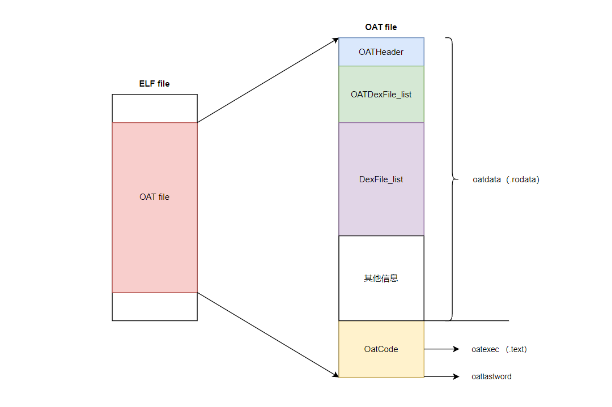

## 基础概念

- **AOT**：编译方式，运行前编译，预编译(Ahead Of Time)。

- **JIT**：编译方式，动态编译。(Just In Time)

- **Dalvik**: 5.0 之前默认虚拟机。

- **ART**：Android 5.0 及其之后默认虚拟机。

- **OAT**：Android 私有 ELF 文件格式，后缀为 .odex。不仅包含从 .dex 翻译过来的二进制本地机器指令，还包含原来的 .dex 文件内容。这使得无需重新编译原 APK 就能直接在 ART 中运行。系统应用文件保存在 /data/dalvik-cache/     外部应用保存在   /data/app/package

  

### 什么是JIT

​		JIT在Android2.2到Android4.4版本（7.0版本也有，后文会叙述），JIT的目的是为了提高Android的运行效率。

​		Dalvik虚拟机可以看做是一个Java虚拟机。在 Android系统初期，每次运行程序的时候，Dalvik负责将dex翻译为机器码交由系统调用。这样有一个**缺陷**：**每次执行代码，都需要Dalvik将操作码代码翻译为机器对应的微处理器指令，然后交给底层系统处理，运行效率很低**。

​		为了提升效率Android在2.2版本中添加了**JIT编译器**，当App运行时，每当遇到一个新类，JIT编译器就会对这个类进行即时编译，经过编译后的代码，会被优化成相当精简的原生型指令码（即native code），这样在下次执行到相同逻辑的时候，速度就会更快。JIT 编译器可以对执行次数频繁的 dex/odex 代码进行编译与优化，将 dex/odex 中的 Dalvik Code（Smali 指令集）翻译成相当精简的 Native Code 去执行，JIT 的引入使得 Dalvik 的性能提升了 3~6 倍。

#### JIT的缺陷

- 每次启动应用都需要重新编译（没有缓存）
- 运行时比较耗电，耗电量大

### ART和AOT

​		AOT是指"Ahead Of Time"，与"Just In Time"不同，从字面来看是说提前编译。

#### 什么是AOT

​		JIT是运行时编译，是**动态编译**，可以对执行次数频繁的dex代码进行编译和优化，减少以后使用时的翻译时间，虽然可以加快Dalvik运行速度，但是有一个很大的问题：将dex翻译为本地机器码也要占用时间。 所以Google在4.4推出了全新的虚拟机运行环境ART（Android RunTime），用来替换Dalvik（4.4上ART和Dalvik共存，用户可以手动选择，5.0 后Dalvik被替换）。

​		AOT 是**静态编译**，应用在安装的时候会启动 dex2oat 过程把 dex预编译成 ELF 文件，每次运行程序的时候不用重新编译。 ART 对 Garbage Collection（GC）过程的也进行了改进：

1. 只有一次 GC 暂停（Dalvik 需要两次）
2. 在 GC 保持暂停状态期间并行处理
3. 在清理最近分配的短时对象这种特殊情况中，回收器的总 GC 时间更短
4. 优化了垃圾回收的工效，能够更加及时地进行并行垃圾回收，这使得 GC_FOR_ALLOC 事件在典型用例中极为罕见
5. 压缩 GC 以减少后台内存使用和碎片

#### AOT的缺陷

- 应用安装和系统升级之后的应用优化比较耗时（重新编译，把程序代码转换成机器语言）
- 优化后的文件会占用额外的存储空间（缓存转换结果）

### JIT和AOT共存

Android 7.0上，JIT 编译器被再次使用，采用AOT/JIT 混合编译的策略，特点是：

1. 应用在安装的时候dex不会再被编译
2. App运行时,dex文件先通过解析器被直接执行，热点函数会被识别并被JIT编译后存储在 jit code cache 中并生成profile文件以记录热点函数的信息。
3. 手机进入 IDLE（空闲） 或者 Charging（充电） 状态的时候，系统会扫描 App 目录下的 profile 文件并执行 AOT 过程进行编译。

**总结**

Dalvik，ART是Android的两种运行环境，也可以叫做Android虚拟机 JIT，AOT是Android虚拟机采用的两种不同的编译策略

### Odex文件格式

### Vdex文件

为何要搞出个vdex文件？目的是为了避免不必要的验证Dex 文件合法性的过程，例如首次安装时，进行dex2oat时，会校验Dex 文件各个section的合法性。

1.第一次开机就会生成在**/system/app/<packagename>/oat/**下；
2.在系统运行过程中，虚拟机将其 从**/system/app**下 copy到**/data/davilk-cache/**下

#### odex + vdex = apk的全部源码，vdex并不是独立于odex的文件，odex + vdex才代表一个apk）