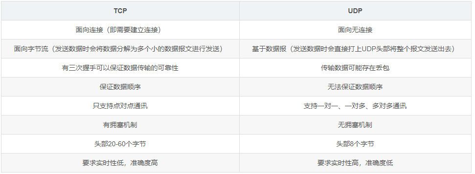

## HTTP1.0 1.1 2.0的区别

### HTTP1.0

不支持长连接，只有短连接，每个请求都要建立一个TCP，连接无法复用

请求数固定，会造成阻塞

### HTTP1.1

新增长连接

缓存优化

错误码增加、新增请求方式、断点续传优化

Host优化

### HTTP2.0

二进制分帧

服务端推送（当浏览器请求一个html，服务端会将后续的资源也一起推送）

多路复用，做到同一个连接并发处理多个请求

报文压缩

## 网络模型

## TCP和UDP

### TCP握手

### TCP挥手

## HTTPS

### 数字签名的制作过程：

1. CA机构拥有非对称加密的私钥和公钥。
2. CA机构对证书明文数据T进行hash。
3. 对hash后的值用私钥加密，得到数字签名S。

### 浏览器校验证书过程

1. 拿到证书，得到明文T，签名S。
2. 用CA机构的公钥对S解密（由于是浏览器信任的机构，所以浏览器保有它的公钥），得到S’。
3. 用证书里指明的hash算法对明文T进行hash得到T’。
4. 显然通过以上步骤，T’应当等于S‘，除非明文或签名被篡改。所以此时比较S’是否等于T’，等于则表明证书可信。

### 加密过程

1. 某网站拥有用于非对称加密的公钥A、私钥A’。
2. 浏览器向网站服务器请求，服务器把证书传输给浏览器。
3. 浏览器从证书里获取公钥
4. 浏览器随机生成一个用于对称加密的密钥X，用公钥A加密后传给服务器。
5. 服务器拿到后用私钥A’解密得到密钥X。
6. 这样双方就都拥有密钥X了，且别人无法知道它。之后双方所有数据都通过密钥X加密解密即可。

### 证书签名过程

