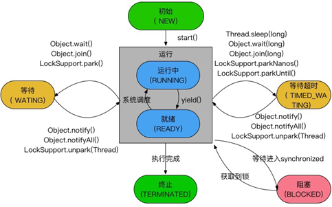

## CAS

### 自旋锁

首先，内核态与用户态的切换上不容易优化。但**通过自旋锁，可以减少线程阻塞造成的线程切换**（包括挂起线程和恢复线程）。

如果锁的粒度小，那么**锁的持有时间比较短**（尽管具体的持有时间无法得知，但可以认为，通常有一部分锁能满足上述性质）。那么，对于竞争这些锁的而言，因为锁阻塞造成线程切换的时间与锁持有的时间相当，减少线程阻塞造成的线程切换，能得到较大的性能提升。具体如下：

- 当前线程竞争锁失败时，打算阻塞自己
- 不直接阻塞自己，而是自旋（空等待，比如一个空的有限for循环）一会
- 在自旋的同时重新竞争锁
- 如果自旋结束前获得了锁，那么锁获取成功；否则，自旋结束后阻塞自己

*如果在自旋的时间内，锁就被旧owner释放了，那么当前线程就不需要阻塞自己*（也不需要在未来锁释放时恢复），减少了一次线程切换。

“锁的持有时间比较短”这一条件可以放宽。实际上，只要锁竞争的时间比较短（比如线程1快释放锁的时候，线程2才会来竞争锁），就能够提高自旋获得锁的概率。这通常发生在**锁持有时间长，但竞争不激烈**的场景中。

#### 缺点

- 单核处理器上，不存在实际的并行，当前线程不阻塞自己的话，旧owner就不能执行，锁永远不会释放，此时不管自旋多久都是浪费；进而，如果线程多而处理器少，自旋也会造成不少无谓的浪费。
- 自旋锁要占用CPU，如果是计算密集型任务，这一优化通常得不偿失，减少锁的使用是更好的选择。
- 如果锁竞争的时间比较长，那么自旋通常不能获得锁，白白浪费了自旋占用的CPU时间。这通常发生在*锁持有时间长，且竞争激烈*的场景中，此时应主动禁用自旋锁。

> 使用-XX:-UseSpinning参数关闭自旋锁优化；-XX:PreBlockSpin参数修改默认的自旋次数。

### 自适应自旋锁

自适应意味着自旋的时间不再固定了，而是由前一次在同一个锁上的自旋时间及锁的拥有者的状态来决定：

- 如果在同一个锁对象上，自旋等待刚刚成功获得过锁，并且持有锁的线程正在运行中，那么虚拟机就会认为这次自旋也很有可能再次成功，进而它将允许自旋等待持续相对更长的时间，比如100个循环。
- 相反的，如果对于某个锁，自旋很少成功获得过，那在以后要获取这个锁时将可能减少自旋时间甚至省略自旋过程，以避免浪费处理器资源。

**自适应自旋解决的是“锁竞争时间不确定”的问题**。JVM很难感知到确切的锁竞争时间，而交给用户分析就违反了JVM的设计初衷。*自适应自旋假定不同线程持有同一个锁对象的时间基本相当，竞争程度趋于稳定，因此，可以根据上一次自旋的时间与结果调整下一次自旋的时间*。

#### 缺点

然而，自适应自旋也没能彻底解决该问题，*如果默认的自旋次数设置不合理（过高或过低），那么自适应的过程将很难收敛到合适的值*。

## synchronized

锁代码块

monitorenter

monitorexit

## 锁的状态

一共有四种状态，**无锁状态，偏向锁状态，轻量级锁状态和重量级锁状态**，它会随着竞争情况逐渐升级。锁可以升级但不能降级，目的是为了提高获得锁和释放锁的效率。

### 偏向锁

在没有实际竞争的情况下，还能够针对部分场景继续优化。如果不仅仅没有实际竞争，自始至终，使用锁的线程都只有一个，那么，维护轻量级锁都是浪费的。**偏向锁的目标是，减少无竞争且只有一个线程使用锁的情况下，使用轻量级锁产生的性能消耗**。轻量级锁每次申请、释放锁都至少需要一次CAS，但偏向锁只有初始化时需要一次CAS。

### 轻量级锁

轻量级锁是由偏向锁升级来的，偏向锁运行在一个线程进入同步块的情况下，当第二个线程加入锁争用的时候，偏向锁就会升级为轻量级锁； 

当多线程竞争，cas一直自旋，当自旋一定次数后会升级成重量级锁

### 重量级锁

会阻塞线程，需要上下文切换，资源开销大   5000-20000个指令  一个指令0.6纳秒

内置锁在Java中被抽象为监视器锁（monitor）。在JDK 1.6之前，监视器锁可以认为直接对应底层操作系统中的互斥量（mutex）。这种同步方式的成本非常高，包括系统调用引起的内核态与用户态切换、线程阻塞造成的线程切换等。因此，后来称这种锁为“重量级锁”。

## 线程状态

